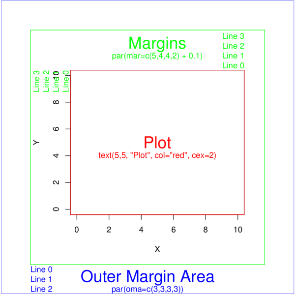

# R Plotting Basics

### Daniel J. Hocking
### 09 December 2013
### UNH R Working Group

Set working directory and load data

```r
setwd("/Users/Dan/Documents/Teaching/R_intro/03_Plotting_Basics/")

library(RCurl)
foo <- getURL("https://raw.github.com/djhocking/R_Intro/master/Data/Salamander_Demographics.csv", 
    ssl.verifypeer = TRUE)
demo <- read.table(textConnection(foo), header = TRUE, sep = ",", na.strings = NA)
# demo <- read.table('Salamander_Demographics.csv', header = TRUE, sep =
# ',') # alternatively you can download data from GitHub into your working
# directory and load from the local file

str(demo)
```

```
## 'data.frame':	3382 obs. of  20 variables:
##  $ line  : int  1861 1115 360 2897 1432 372 231 2739 2236 543 ...
##  $ page  : int  60 36 12 92 46 12 8 87 72 17 ...
##  $ dates : Factor w/ 81 levels "10/1/08","10/16/08",..: 12 81 32 36 2 32 28 3 15 59 ...
##  $ month : int  4 9 5 5 10 5 5 10 5 6 ...
##  $ day   : int  21 9 31 7 16 31 27 24 14 5 ...
##  $ year  : int  2009 2008 2008 2011 2008 2008 2008 2009 2009 2008 ...
##  $ time  : Factor w/ 2 levels "D","N": 2 2 2 2 2 2 2 2 2 2 ...
##  $ plot  : Factor w/ 12 levels "1","3","4","5",..: 4 NA 2 5 7 2 7 9 4 5 ...
##  $ mass  : num  0.427 0.633 0.639 0.921 0.943 ...
##  $ svl   : int  33 37 42 43 45 46 47 48 NA NA ...
##  $ tl    : int  63 68 63 79 74 NA 75 89 87 NA ...
##  $ sex   : Factor w/ 5 levels "U","UA","UI",..: NA NA NA NA NA NA NA NA NA NA ...
##  $ gravid: Factor w/ 3 levels "D","N","Y": 2 2 2 2 2 2 2 2 2 2 ...
##  $ group : Factor w/ 6 levels "GF","NG","U",..: NA NA NA NA NA NA NA NA NA NA ...
##  $ clutch: int  NA NA NA NA NA NA NA NA NA NA ...
##  $ color : Factor w/ 4 levels "BLOTCHY","L",..: 3 3 3 3 2 3 3 3 3 3 ...
##  $ recap : Factor w/ 2 levels "N","Y": NA NA NA 1 NA NA NA NA NA NA ...
##  $ mark  : Factor w/ 38 levels "OGGX","OOOX",..: NA NA NA NA NA NA NA NA NA NA ...
##  $ id    : int  1371 NA 187 2154 1042 198 74 2036 1564 351 ...
##  $ damage: Factor w/ 2 levels "N","Y": 1 1 2 1 2 1 1 1 2 1 ...
```

```r
head(demo)
```

```
##   line page    dates month day year time plot  mass svl tl  sex gravid
## 1 1861   60  4/21/09     4  21 2009    N    5 0.427  33 63 <NA>      N
## 2 1115   36   9/9/08     9   9 2008    N <NA> 0.633  37 68 <NA>      N
## 3  360   12  5/31/08     5  31 2008    N    3 0.639  42 63 <NA>      N
## 4 2897   92   5/7/11     5   7 2011    N    7 0.921  43 79 <NA>      N
## 5 1432   46 10/16/08    10  16 2008    N    9 0.943  45 74 <NA>      N
## 6  372   12  5/31/08     5  31 2008    N    3    NA  46 NA <NA>      N
##   group clutch color recap mark   id damage
## 1  <NA>     NA     R  <NA> <NA> 1371      N
## 2  <NA>     NA     R  <NA> <NA>   NA      N
## 3  <NA>     NA     R  <NA> <NA>  187      Y
## 4  <NA>     NA     R     N <NA> 2154      N
## 5  <NA>     NA     L  <NA> <NA> 1042      Y
## 6  <NA>     NA     R  <NA> <NA>  198      N
```

```r
tail(demo)
```

```
##      line page    dates month day year time plot  mass svl tl sex gravid
## 3377 1435   46 10/16/08    10  16 2008    N    4 1.174  48 86   Y      N
## 3378 2765   88   5/4/11     5   4 2011    N    7 0.974  49 89   Y      N
## 3379 3248  103   6/9/11     6   9 2011    N    9 1.204  49 87   Y      N
## 3380 1503   49  11/6/08    11   6 2008    N    4 1.365  49 89   Y      N
## 3381 1475   48  11/1/08    11   1 2008    D   T1 1.295  50 93   Y      N
## 3382  494   16   6/4/08     6   4 2008    N    9 0.814  51 69   Y      N
##      group clutch color recap mark   id damage
## 3377     Y     NA     R  <NA> <NA> 1045      N
## 3378     Y     NA     R     N <NA> 2022      N
## 3379     Y     NA     R     N <NA> 2464      Y
## 3380     Y     NA     R  <NA> <NA> 1079      N
## 3381     Y     NA     R  <NA> <NA> 1101      N
## 3382     Y     NA     R  <NA> <NA>  292      N
```

```r
summary(demo)
```

```
##       line           page           dates          month      
##  Min.   :   1   Min.   :  1.0   4/21/09: 166   Min.   : 4.00  
##  1st Qu.: 846   1st Qu.: 27.0   5/31/08: 158   1st Qu.: 5.00  
##  Median :1692   Median : 55.0   6/9/11 : 147   Median : 6.00  
##  Mean   :1692   Mean   : 54.3   5/29/09: 107   Mean   : 6.31  
##  3rd Qu.:2537   3rd Qu.: 82.0   6/4/08 : 106   3rd Qu.: 6.00  
##  Max.   :3382   Max.   :107.0   9/9/08 : 104   Max.   :11.00  
##                                 (Other):2594                  
##       day            year      time          plot          mass      
##  Min.   : 1.0   Min.   :2008   D: 206   5      :709   Min.   :0.061  
##  1st Qu.: 8.0   1st Qu.:2008   N:3176   4      :671   1st Qu.:0.511  
##  Median :15.0   Median :2008            3      :616   Median :0.718  
##  Mean   :15.4   Mean   :2009            9      :615   Mean   :0.708  
##  3rd Qu.:22.0   3rd Qu.:2009            7      :586   3rd Qu.:0.887  
##  Max.   :31.0   Max.   :2011            (Other):181   Max.   :1.929  
##                                         NA's   :  4   NA's   :2      
##       svl             tl          sex        gravid      group     
##  Min.   :15.0   Min.   : 20.0   U   : 812   D   : 128   GF  : 241  
##  1st Qu.:34.0   1st Qu.: 59.0   UA  :   8   N   :2952   NG  : 775  
##  Median :39.0   Median : 69.0   UI  : 226   Y   : 241   U   : 812  
##  Mean   :38.1   Mean   : 66.9   X   :1077   NA's:  61   UA  :   8  
##  3rd Qu.:43.0   3rd Qu.: 77.0   Y   :1249               UI  : 226  
##  Max.   :55.0   Max.   :105.0   NA's:  10               Y   :1249  
##  NA's   :3      NA's   :2                               NA's:  71  
##      clutch         color       recap           mark            id      
##  Min.   : 2.0   BLOTCHY:   3   N   : 600   XXXY   :   2   Min.   :   1  
##  1st Qu.: 6.0   L      :  74   Y   :  48   OGGX   :   1   1st Qu.: 594  
##  Median : 7.0   R      :3283   NA's:2734   OOOX   :   1   Median :1397  
##  Mean   : 7.5   TAN    :  17               OORG   :   1   Mean   :1329  
##  3rd Qu.: 9.0   NA's   :   5               ORGO   :   1   3rd Qu.:2012  
##  Max.   :13.0                              (Other):  33   Max.   :2598  
##  NA's   :3117                              NA's   :3343   NA's   :1003  
##  damage  
##  N:2106  
##  Y:1276  
##          
##          
##          
##          
## 
```


Scatterplot

```r
plot(demo$svl, demo$mass, xlab = "Snout-vent length (mm)", ylab = "Mass (g)")
```

 


Add different symbols for males, females, juveniles (UI)

```r
plot(demo$svl, demo$mass, xlab = "Snout-vent length (mm)", ylab = "Mass (g)", 
    pch = as.integer(demo$sex))
```

 


Add colors for males, females, juveniles (UI)

```r
plot(demo$svl, demo$mass, xlab = "Snout-vent length (mm)", ylab = "Mass (g)", 
    pch = as.integer(demo$sex), col = as.integer(demo$sex))
```

 


Add smooth spline (curve through the points). You don't need to make the plot again. The function "lines" adds the line to the most recent plot. In this case, smooth.spline doesn't handle missing data so we have to take it out explicitly.

```r
lines(smooth.spline(demo[which(demo$svl != "NA" & demo$mass != "NA"), ]$svl, 
    demo[which(demo$svl != "NA" & demo$mass != "NA"), ]$mass))
```

```
## Error: plot.new has not been called yet
```


Add legend

```r
legend(x = 15, y = 1.9, legend = levels(demo$sex), pch = 1:5, col = 1:5)
```

```
## Error: plot.new has not been called yet
```


Fix the spacing around the plot and the tick marks. 



via http://rgraphics.limnology.wisc.edu/rmargins_sf.php. More info at http://rfunction.com/archives/1302

Final Plot using base R graphics and export as pdf, eps, tiff, etc.

Table from Quick-R (http://www.statmethods.net/graphs/creating.html)

|Function                     | Output to         |
| --------------------------- | ----------------- |
|pdf("mygraph.pdf")           |	pdf file          |
|win.metafile("mygraph.wmf")  |	windows metafile  |
|png("mygraph.png")           |	png file          |
|jpeg("mygraph.jpg")          |	jpeg file         |
|bmp("mygraph.bmp")           |	bmp file          |
|postscript("mygraph.ps")     |	postscript file   |


Putting it all together:

```r
pdf("SVL-Mass.pdf", width = 10, height = 8)
par(mar = c(3.5, 3, 2, 1), mgp = c(2, 0.7, 0), tck = -0.02)
plot(demo$svl, demo$mass, xlab = "Snout-vent length (mm)", ylab = "Mass (g)", 
    pch = as.integer(demo$sex), col = as.integer(demo$sex))
lines(smooth.spline(demo[which(demo$svl != "NA" & demo$mass != "NA"), ]$svl, 
    demo[which(demo$svl != "NA" & demo$mass != "NA"), ]$mass))
legend(x = 15, y = 1.9, legend = c("Unknown", "Adult", "Juvenile", "Female", 
    "Male"), pch = 1:5, col = 1:5)
dev.off()
```

 

```
## RStudioGD 
##         2
```


Other Base Plots

Histogram

```r
hist(demo$mass, breaks = 20)
```

 


Kernel Density

```r
plot(density(demo$mass, na.rm = TRUE))
```

 


Boxplot

```r
boxplot(demo$mass ~ demo$sex, ylab = "Mass (g)")
```

 


### Activity: Make a kernel density plot on top of a histogram

