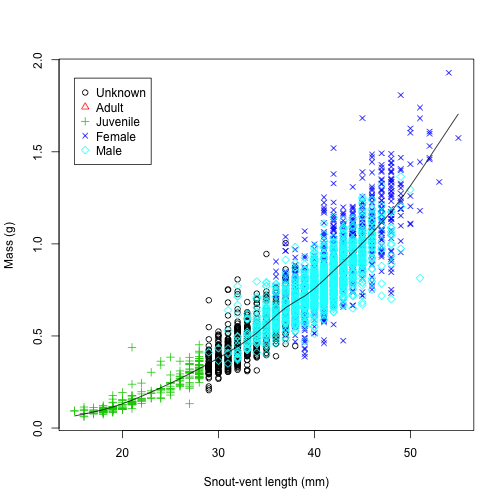
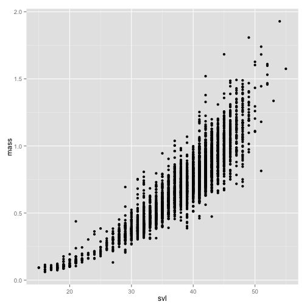
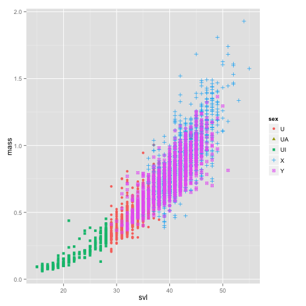
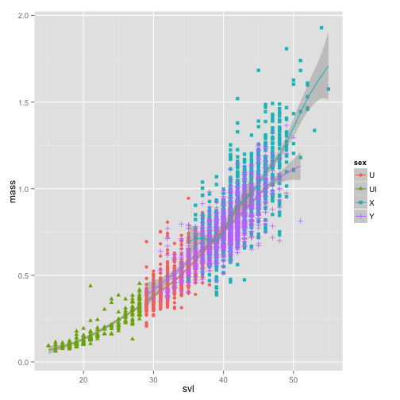
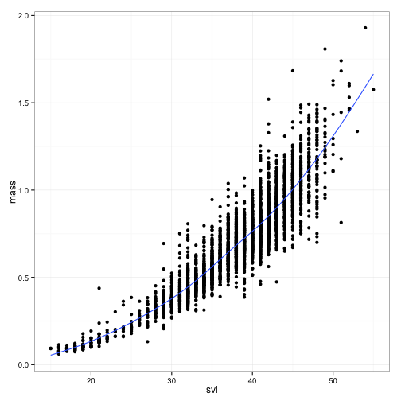
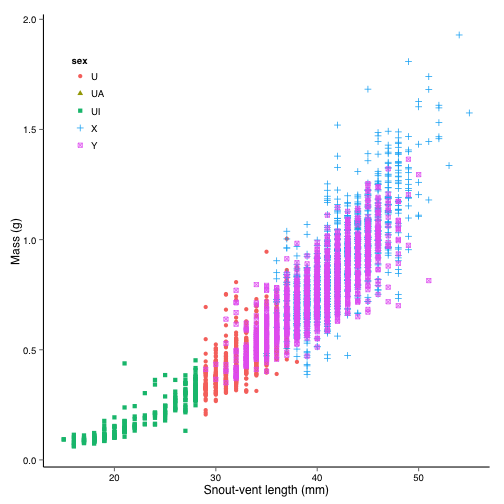

# R Plotting: ggplot2

### Daniel J. Hocking
### 16 December 2013
### UNH R Working Group

ggplot2 is an R package for graphing that uses a specific grammar to build graphics in a series of layers starting with the raw data. The grammar is based on "Grammar of Graphics" (Wilkinson 2005).   

There is a tremendous amount of information available on ggplot2 online, owing to its popularity. There is also a book describing the package, "ggplot2: Elegant Graphics for Data Analysis" (Wickham 2009). The package creator, Hadley Wickham, provides information on his website: [http://had.co.nz/ggplot2](http://had.co.nz/ggplot2).   


Basic Grammar Components:   
* data: data to visualize
* mapping: aesthetics describing how data are mapped to attributes
* geom: geometric objects printed on plot such as points, lines, polygons 
* stats: optional statistics transformations for binning, counting, and summarizing data
* scale: translates data scales to aesthetic scales like color, size, shape and draws legend and axes
* coord: coordinate system describes how data and mapped to plane of graphic and provides axes and grid lines. Cartesian coordinates, polar coordinates, or map projections
* facet: faceting specifies how to break data into subsets (conditioning, latticing, or trellising)
* fonts, colors, etc. are specied via that theme and not as graphical grammar components   

First, import the salamander demographics data


```r
setwd("/Users/Dan/Documents/Teaching/R_intro/04_Plotting_Packages/")

library(RCurl)
foo <- getURL("https://raw.github.com/djhocking/R_Intro/master/Data/Salamander_Demographics.csv", 
    followlocation = TRUE, cainfo = system.file("CurlSSL", "cacert.pem", package = "RCurl"))
demo <- read.table(textConnection(foo), header = TRUE, sep = ",", na.strings = NA)
# demo <- read.table('Salamander_Demographics.csv', header = TRUE, sep =
# ',') # alternatively you can download data from GitHub into your working
# directory and load from the local file
```


Remember the plot we created previously to visualize mass as a function of snout-vent length with different colors for different sex/age classes (below). We are going to recreate this using ggplot2


```r
# par(mar = c(3.5,3,2,1), mgp = c(2,.7,0), tck = -.02)
plot(demo$svl, demo$mass, xlab = "Snout-vent length (mm)", ylab = "Mass (g)", 
    pch = as.integer(demo$sex), col = as.integer(demo$sex))
lines(smooth.spline(demo[which(demo$svl != "NA" & demo$mass != "NA"), ]$svl, 
    demo[which(demo$svl != "NA" & demo$mass != "NA"), ]$mass))
legend(x = 15, y = 1.9, legend = c("Unknown", "Adult", "Juvenile", "Female", 
    "Male"), pch = 1:5, col = 1:5)
```

 


We will start with a quick plot using the `qplot` function:


```r
library(ggplot2)
qplot(svl, mass, data = demo)
```

```
## Warning: Removed 5 rows containing missing values (geom_point).
```

 


This looks very similar to our original plot but with a different background and filled points. It also automatically removed missing values and produced a warning to let us know. This is using `geom = "point"` by default to produce a scatterplot because x and y values were supplied. With more ease than with the base `plot` function, we can add different colors and shapes for animals of different sexes and included a legend:


```r
qplot(svl, mass, data = demo,   # I only separate rows after the column so you can see what I added
      colour = sex,             # notice the British spelling b/c Hadley is from NZ
      shape = sex)
```

```
## Warning: Removed 12 rows containing missing values (geom_point).
```

 


This was much easier than the base plot code! Now let's add the smoothing spline with the geom `smooth`:


```r
library(mgcv)  # needed for the smooth option with large datasets to do gam
qplot(svl, mass, data = demo[which(demo$sex != "UA"), ], colour = sex, shape = sex, 
    geom = c("point", "smooth"))
```

```
## geom_smooth: method="auto" and size of largest group is >=1000, so using
## gam with formula: y ~ s(x, bs = "cs"). Use 'method = x' to change the
## smoothing method.
```

```
## Warning: Removed 1 rows containing missing values (stat_smooth). Warning:
## Removed 1 rows containing missing values (stat_smooth). Warning: Removed 2
## rows containing missing values (geom_point).
```

 


AFTER the plot is created the non-data part of the graphic can be manipulated by altering the theme. There are built-in themes or you can customize any aspect with your own theme. Themes can also be changed on a global setting with the `theme_set(theme_grey())` funtion or locally with the `qplot(...) + theme_grey()`. 


```r
qplot(svl, mass, data = demo[which(demo$sex != "UA"), ]) + geom_smooth(se = FALSE) + 
    theme_bw()
```

```
## geom_smooth: method="auto" and size of largest group is >=1000, so using
## gam with formula: y ~ s(x, bs = "cs"). Use 'method = x' to change the
## smoothing method.
```

```
## Warning: Removed 2 rows containing missing values (stat_smooth). Warning:
## Removed 2 rows containing missing values (geom_point).
```

 


Let's make a custom theme


```r
theme_eco <- function(base_size = 12, base_family = "Helvetica", legend_position = "right") {
    theme(text = element_text(family = base_family, face = "plain", colour = "black", 
        size = base_size), panel.background = element_blank(), legend.key = element_blank(), 
        panel.grid.minor = element_blank(), panel.grid.major = element_blank(), 
        axis.line = element_line(colour = "black"), axis.text.x = element_text(colour = "black"), 
        axis.text.y = element_text(colour = "black"), legend.position = legend_position)
}


p1 <- qplot(svl, mass, data = demo, colour = sex, shape = sex, xlab = "Snout-vent length (mm)", 
    ylab = "Mass (g)")

p1 + theme_eco(legend_position = c(0.1, 0.8))
```

```
## Warning: Removed 12 rows containing missing values (geom_point).
```

 


Other quick plots using ggplot include boxplots, histograms, and density plots.


```r
library(grid)

plot1 <- qplot(svl, mass, data = demo, geom = "point") + theme_eco()
plot2 <- qplot(svl, data = demo, geom = "histogram") + theme_eco()
plot3 <- qplot(svl, data = demo, geom = "density") + theme_eco()
plot4 <- qplot(sex, svl, data = demo, geom = "boxplot") + theme_eco()

vplayout <- function(x, y) viewport(layout.pos.row = x, layout.pos.col = y)
grid.newpage()
pushViewport(viewport(layout = grid.layout(2, 2)))
print(plot1, vp = vplayout(1, 1))
```

```
## Warning: Removed 5 rows containing missing values (geom_point).
```

```r
print(plot2, vp = vplayout(1, 2))
```

```
## stat_bin: binwidth defaulted to range/30. Use 'binwidth = x' to adjust
## this.
```

```r
print(plot3, vp = vplayout(2, 1))
```

```
## Warning: Removed 3 rows containing non-finite values (stat_density).
```

```r
print(plot4, vp = vplayout(2, 2))
```

```
## Warning: Removed 3 rows containing non-finite values (stat_boxplot).
```

 


Facets are like lattice plots. They easily replicate plots in a grid by a categorical variable.


```r

qplot(svl, mass, data = demo) + facet_grid(. ~ sex)
```

```
## Warning: Removed 1 rows containing missing values (geom_point). Warning:
## Removed 1 rows containing missing values (geom_point). Warning: Removed 3
## rows containing missing values (geom_point).
```

 


