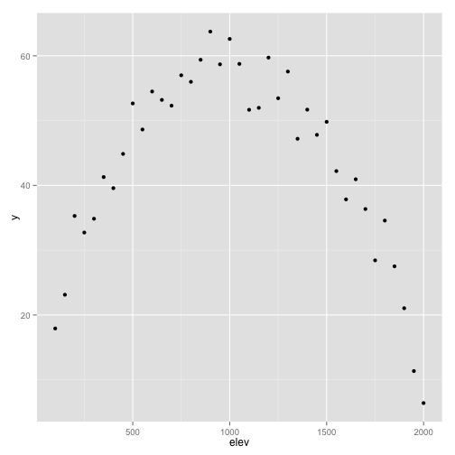

# Basic Statistics in R

### Daniel J. Hocking
### 21 January 2014
### UNH R Working Group

## Load Data and Packages

```r
library(RCurl)

setwd("/Users/Dan/Documents/Teaching/R_intro/05_Linear_Regression/")

foo <- getURL("https://raw.github.com/djhocking/R_Intro/master/Data/Salamander_Demographics.csv", 
    followlocation = TRUE, cainfo = system.file("CurlSSL", "cacert.pem", package = "RCurl"))

demo <- read.table(textConnection(foo), header = TRUE, sep = ",", na.strings = NA)
```


## Linear Regression

Remember our plot from last time showing the relationship between mass and snout-vent length:


```r
library(ggplot2)
p1 <- ggplot(data = demo, aes(x = svl, y = mass, colour = sex, shape = sex))
p1 + geom_point() + xlab("Snout-vent length (mm)") + ylab("Mass (g)") + theme_bw(legend_position = c(0.1, 
    0.8))
```

```
## Error: unused argument (legend_position = c(0.1, 0.8))
```


We're interested in the relationship between length and mass. It is nonlinear, so we can log transform both variables to make it linear. A simple linear regression would be:


```r
m1 <- lm(log(mass) ~ log(svl), data = demo)
m1  # doesn't show us much information
```

```
## 
## Call:
## lm(formula = log(mass) ~ log(svl), data = demo)
## 
## Coefficients:
## (Intercept)     log(svl)  
##       -9.39         2.47
```

```r
summary(m1)  # shows us the info we're genearlly looking for
```

```
## 
## Call:
## lm(formula = log(mass) ~ log(svl), data = demo)
## 
## Residuals:
##     Min      1Q  Median      3Q     Max 
## -0.7728 -0.0942 -0.0057  0.0885  1.0473 
## 
## Coefficients:
##             Estimate Std. Error t value Pr(>|t|)    
## (Intercept)  -9.3926     0.0490    -192   <2e-16 ***
## log(svl)      2.4699     0.0135     183   <2e-16 ***
## ---
## Signif. codes:  0 '***' 0.001 '**' 0.01 '*' 0.05 '.' 0.1 ' ' 1
## 
## Residual standard error: 0.152 on 3375 degrees of freedom
##   (5 observations deleted due to missingness)
## Multiple R-squared:  0.908,	Adjusted R-squared:  0.908 
## F-statistic: 3.34e+04 on 1 and 3375 DF,  p-value: <2e-16
```


In the `lm` function in R, the intercept is assumed so it is not written in the model usually. However, it can be explicitly added and the model is the same. Most people do not write the `1` for the intercept but if it helps you better understand the model you can include it.


```r
m1a <- lm(log(mass) ~ 1 + log(svl), data = demo)
summary(m1a)
```

```
## 
## Call:
## lm(formula = log(mass) ~ 1 + log(svl), data = demo)
## 
## Residuals:
##     Min      1Q  Median      3Q     Max 
## -0.7728 -0.0942 -0.0057  0.0885  1.0473 
## 
## Coefficients:
##             Estimate Std. Error t value Pr(>|t|)    
## (Intercept)  -9.3926     0.0490    -192   <2e-16 ***
## log(svl)      2.4699     0.0135     183   <2e-16 ***
## ---
## Signif. codes:  0 '***' 0.001 '**' 0.01 '*' 0.05 '.' 0.1 ' ' 1
## 
## Residual standard error: 0.152 on 3375 degrees of freedom
##   (5 observations deleted due to missingness)
## Multiple R-squared:  0.908,	Adjusted R-squared:  0.908 
## F-statistic: 3.34e+04 on 1 and 3375 DF,  p-value: <2e-16
```


This is fine, but based on our plot the sex of animals could influence the mass so we can add that as a parameter.


```r
m2 <- lm(log(mass) ~ log(svl) + sex, data = demo)
summary(m2)
```

```
## 
## Call:
## lm(formula = log(mass) ~ log(svl) + sex, data = demo)
## 
## Residuals:
##     Min      1Q  Median      3Q     Max 
## -0.7179 -0.0931 -0.0045  0.0887  1.0628 
## 
## Coefficients:
##             Estimate Std. Error t value Pr(>|t|)    
## (Intercept) -8.84651    0.09866  -89.67  < 2e-16 ***
## log(svl)     2.31296    0.02820   82.03  < 2e-16 ***
## sexUA        0.06300    0.05422    1.16   0.2453    
## sexUI       -0.08371    0.01594   -5.25  1.6e-07 ***
## sexX         0.05952    0.00992    6.00  2.2e-09 ***
## sexY         0.02432    0.00886    2.75   0.0061 ** 
## ---
## Signif. codes:  0 '***' 0.001 '**' 0.01 '*' 0.05 '.' 0.1 ' ' 1
## 
## Residual standard error: 0.151 on 3364 degrees of freedom
##   (12 observations deleted due to missingness)
## Multiple R-squared:  0.91,	Adjusted R-squared:  0.91 
## F-statistic: 6.79e+03 on 5 and 3364 DF,  p-value: <2e-16
```


### Task
In pairs or small groups can you test whether there is a significant interaction effect between log(svl) and sex on log(mass)? HINT: An interaction is just created by multipling two predictor variables.

### Solution

```r
m3 <- lm(log(mass) ~ log(svl) * sex, data = demo)
summary(m3)
```

```
## 
## Call:
## lm(formula = log(mass) ~ log(svl) * sex, data = demo)
## 
## Residuals:
##     Min      1Q  Median      3Q     Max 
## -0.7767 -0.0936 -0.0043  0.0884  1.0786 
## 
## Coefficients:
##                Estimate Std. Error t value Pr(>|t|)    
## (Intercept)     -9.3446     0.2452  -38.10  < 2e-16 ***
## log(svl)         2.4555     0.0702   34.99  < 2e-16 ***
## sexUA           -4.4896     6.0520   -0.74    0.458    
## sexUI           -0.5047     0.3000   -1.68    0.093 .  
## sexX             0.3932     0.3280    1.20    0.231    
## sexY             1.6262     0.2995    5.43  6.0e-08 ***
## log(svl):sexUA   1.1933     1.6009    0.75    0.456    
## log(svl):sexUI   0.1541     0.0896    1.72    0.085 .  
## log(svl):sexX   -0.0986     0.0912   -1.08    0.279    
## log(svl):sexY   -0.4413     0.0842   -5.24  1.7e-07 ***
## ---
## Signif. codes:  0 '***' 0.001 '**' 0.01 '*' 0.05 '.' 0.1 ' ' 1
## 
## Residual standard error: 0.149 on 3360 degrees of freedom
##   (12 observations deleted due to missingness)
## Multiple R-squared:  0.912,	Adjusted R-squared:  0.912 
## F-statistic: 3.86e+03 on 9 and 3360 DF,  p-value: <2e-16
```


In R this is the same as writing out the model more explicitly as:

```r
m3a <- lm(log(mass) ~ 1 + log(svl) + sex + log(svl) * sex, data = demo)
summary(m3a)
```

```
## 
## Call:
## lm(formula = log(mass) ~ 1 + log(svl) + sex + log(svl) * sex, 
##     data = demo)
## 
## Residuals:
##     Min      1Q  Median      3Q     Max 
## -0.7767 -0.0936 -0.0043  0.0884  1.0786 
## 
## Coefficients:
##                Estimate Std. Error t value Pr(>|t|)    
## (Intercept)     -9.3446     0.2452  -38.10  < 2e-16 ***
## log(svl)         2.4555     0.0702   34.99  < 2e-16 ***
## sexUA           -4.4896     6.0520   -0.74    0.458    
## sexUI           -0.5047     0.3000   -1.68    0.093 .  
## sexX             0.3932     0.3280    1.20    0.231    
## sexY             1.6262     0.2995    5.43  6.0e-08 ***
## log(svl):sexUA   1.1933     1.6009    0.75    0.456    
## log(svl):sexUI   0.1541     0.0896    1.72    0.085 .  
## log(svl):sexX   -0.0986     0.0912   -1.08    0.279    
## log(svl):sexY   -0.4413     0.0842   -5.24  1.7e-07 ***
## ---
## Signif. codes:  0 '***' 0.001 '**' 0.01 '*' 0.05 '.' 0.1 ' ' 1
## 
## Residual standard error: 0.149 on 3360 degrees of freedom
##   (12 observations deleted due to missingness)
## Multiple R-squared:  0.912,	Adjusted R-squared:  0.912 
## F-statistic: 3.86e+03 on 9 and 3360 DF,  p-value: <2e-16
```


To see how to add polynomial functions, we will simulate some data and analyze it using a squared term in a linear regression. Lets imagine we're counting the number of beetles on a mountain and we expect they are rare at low and high elevations but abundant at mid elevations.


```r
elev <- seq(from = 100, to = 2000, by = 50)  # sample stations every 50 m elevation
intercept <- 10
b.elev <- 0.1
b.elev2 <- -5e-05
error <- rnorm(length(elev), 0, 5.2)
y <- intercept + b.elev * elev + b.elev2 * elev^2 + error

df <- data.frame(count, elev)
ggplot(df, aes(x = elev, y = y)) + geom_point()
```

 


Linear Regression


```r
lm.count <- lm(count ~ elev + I(elev^2), data = df)
summary(lm.count)
```

```
## 
## Call:
## lm(formula = count ~ elev + I(elev^2), data = df)
## 
## Residuals:
##    Min     1Q Median     3Q    Max 
## -4.281 -1.440 -0.003  1.447  6.153 
## 
## Coefficients:
##              Estimate Std. Error   t value Pr(>|t|)    
## (Intercept)  1.00e+03   1.28e+00     782.1   <2e-16 ***
## elev         9.32e-02   2.80e-03      33.3   <2e-16 ***
## I(elev^2)   -1.00e+00   1.30e-06 -770798.2   <2e-16 ***
## ---
## Signif. codes:  0 '***' 0.001 '**' 0.01 '*' 0.05 '.' 0.1 ' ' 1
## 
## Residual standard error: 2.29 on 36 degrees of freedom
## Multiple R-squared:     1,	Adjusted R-squared:     1 
## F-statistic: 5.48e+12 on 2 and 36 DF,  p-value: <2e-16
```


Now let's make sure our models fit the assumptions of linear regression such as normally distributed error, homogeneity of variance. There are some tests for these but it's often best just to examine the residual plots.


```r
plot(lm.count)
```


```r
plot(m2)

# plot(log(demo$mass), predict(m2))
plot(fitted(m2), resid(m2))
```


## ANOVA

ANOVA is a bit tricky in R. It is different than in SAS. In R the order of the factors matters (equivalent to Type I ANOVA is SAS).


```r
lm1 <- lm(mass ~ sex + plot, data = demo)
a1 <- anova(lm1)
summary(a1)
```

```
##        Df           Sum Sq          Mean Sq         F value      
##  Min.   :   4   Min.   :  1.58   Min.   : 0.03   Min.   :   4.8  
##  1st Qu.:   8   1st Qu.: 50.87   1st Qu.: 0.09   1st Qu.: 316.9  
##  Median :  11   Median :100.15   Median : 0.14   Median : 628.9  
##  Mean   :1122   Mean   : 83.83   Mean   :12.54   Mean   : 628.9  
##  3rd Qu.:1682   3rd Qu.:124.96   3rd Qu.:18.79   3rd Qu.: 941.0  
##  Max.   :3352   Max.   :149.76   Max.   :37.44   Max.   :1253.0  
##                                                  NA's   :1       
##      Pr(>F) 
##  Min.   :0  
##  1st Qu.:0  
##  Median :0  
##  Mean   :0  
##  3rd Qu.:0  
##  Max.   :0  
##  NA's   :1
```

```r

lm2 <- lm(mass ~ plot + sex, data = demo)
a2 <- anova(lm2)
summary(a2)
```

```
##        Df           Sum Sq          Mean Sq         F value    
##  Min.   :   4   Min.   :  4.92   Min.   : 0.03   Min.   :  15  
##  1st Qu.:   8   1st Qu.: 52.54   1st Qu.: 0.24   1st Qu.: 318  
##  Median :  11   Median :100.15   Median : 0.45   Median : 620  
##  Mean   :1122   Mean   : 83.83   Mean   :12.36   Mean   : 620  
##  3rd Qu.:1682   3rd Qu.:123.28   3rd Qu.:18.53   3rd Qu.: 922  
##  Max.   :3352   Max.   :146.41   Max.   :36.60   Max.   :1225  
##                                                  NA's   :1     
##      Pr(>F) 
##  Min.   :0  
##  1st Qu.:0  
##  Median :0  
##  Mean   :0  
##  3rd Qu.:0  
##  Max.   :0  
##  NA's   :1
```


The easiest way to get an ANOVA more inline with SAS is to use the `car` package which goes along with John Fox's book, "Companion to Applied Regression".


```r
library(car)
a1.car <- Anova(lm1)
summary(a1.car)
```

```
##      Sum Sq             Df          F value           Pr(>F) 
##  Min.   :  1.58   Min.   :   4   Min.   :   4.8   Min.   :0  
##  1st Qu.: 50.87   1st Qu.:   8   1st Qu.: 309.9   1st Qu.:0  
##  Median :100.15   Median :  11   Median : 614.9   Median :0  
##  Mean   : 82.72   Mean   :1122   Mean   : 614.9   Mean   :0  
##  3rd Qu.:123.28   3rd Qu.:1682   3rd Qu.: 920.0   3rd Qu.:0  
##  Max.   :146.41   Max.   :3352   Max.   :1225.1   Max.   :0  
##                                  NA's   :1        NA's   :1
```

```r

a2.car <- Anova(lm2)
summary(a2.car)
```

```
##      Sum Sq             Df          F value           Pr(>F) 
##  Min.   :  1.58   Min.   :   4   Min.   :   4.8   Min.   :0  
##  1st Qu.: 50.87   1st Qu.:   8   1st Qu.: 309.9   1st Qu.:0  
##  Median :100.15   Median :  11   Median : 614.9   Median :0  
##  Mean   : 82.72   Mean   :1122   Mean   : 614.9   Mean   :0  
##  3rd Qu.:123.28   3rd Qu.:1682   3rd Qu.: 920.0   3rd Qu.:0  
##  Max.   :146.41   Max.   :3352   Max.   :1225.1   Max.   :0  
##                                  NA's   :1        NA's   :1
```


### Task
Spend some time looking at relationships among other variables in the demo data or with your own data. Make some plots, run some regressions, compare the summaries. Compare simple and complex models.


